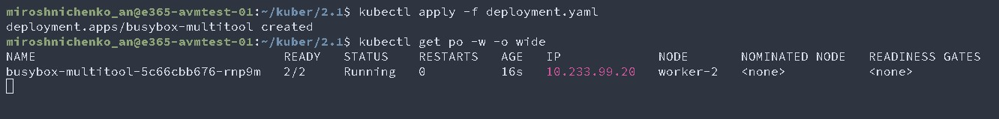
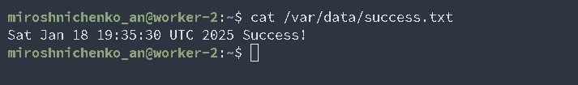
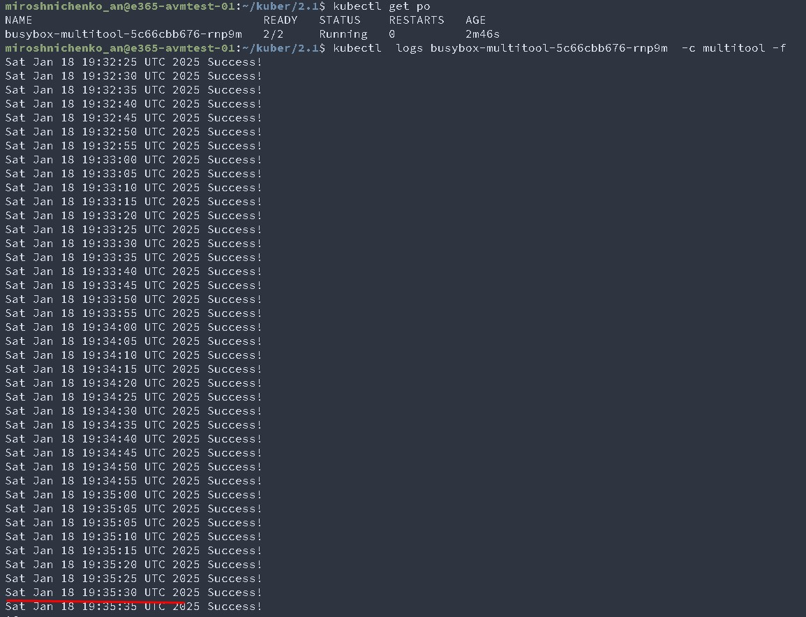
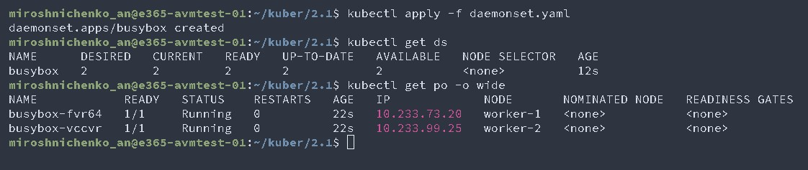
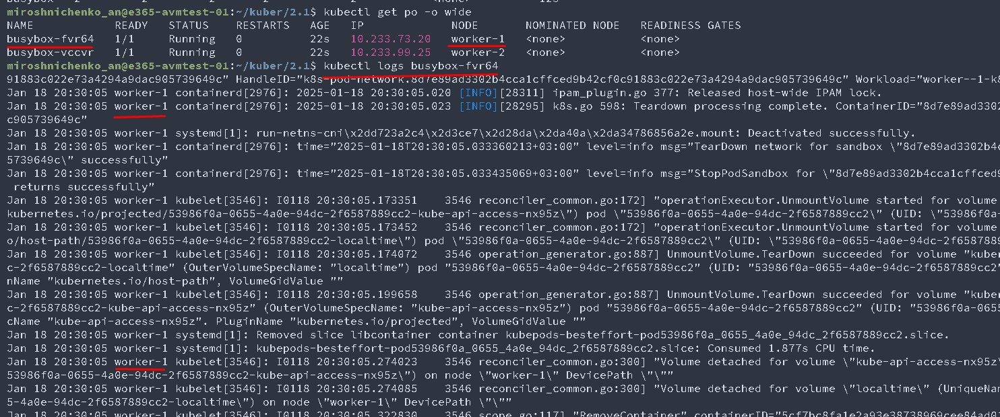
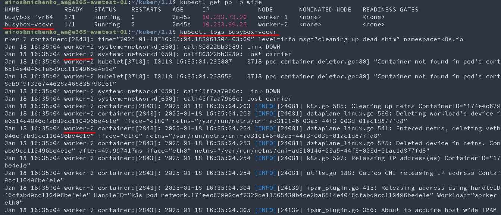

# Домашнее задание к занятию «Хранение в K8s. Часть 1»

### Цель задания

В тестовой среде Kubernetes нужно обеспечить обмен файлами между контейнерам пода и доступ к логам ноды.

------

### Чеклист готовности к домашнему заданию

1. Установленное K8s-решение (например, MicroK8S).
2. Установленный локальный kubectl.
3. Редактор YAML-файлов с подключенным GitHub-репозиторием.

------

### Дополнительные материалы для выполнения задания

1. [Инструкция по установке MicroK8S](https://microk8s.io/docs/getting-started).
2. [Описание Volumes](https://kubernetes.io/docs/concepts/storage/volumes/).
3. [Описание Multitool](https://github.com/wbitt/Network-MultiTool).

------

### Задание 1 

**Что нужно сделать**

Создать Deployment приложения, состоящего из двух контейнеров и обменивающихся данными.

1. Создать Deployment приложения, состоящего из контейнеров busybox и multitool.
```
apiVersion: apps/v1
kind: Deployment
metadata:
  name: busybox-multitool
  labels:
    app: busybox-multitool
spec:
  replicas: 1
  selector:
    matchLabels:
      app: busybox-multitool
  template:
    metadata:
      labels:
        app: busybox-multitool
    spec:
      containers:
      - name: busybox
        image: busybox
        imagePullPolicy: IfNotPresent
        command: ['sh', '-c', 'while true; do sleep 5;  echo $(date) Success! > /output/success.txt; done;']
        volumeMounts:
        - name: vol
          mountPath: /output
      - name: multitool
        image: praqma/network-multitool:latest
        imagePullPolicy: IfNotPresent
        command: ['sh', '-c', 'while true; do  sleep 5;  cat /input/success.txt; done;']
        volumeMounts:
        - name: vol
          mountPath: /input        
      volumes:
      - name: vol    
        hostPath:
          path: /var/data  
```
   
2. Сделать так, чтобы busybox писал каждые пять секунд в некий файл в общей директории.
    
3. Обеспечить возможность чтения файла контейнером multitool.
4. Продемонстрировать, что multitool может читать файл, который периодоически обновляется.
    
5. Предоставить манифесты Deployment в решении, а также скриншоты или вывод команды из п. 4.

------

### Задание 2

**Что нужно сделать**

Создать DaemonSet приложения, которое может прочитать логи ноды.

1. Создать DaemonSet приложения, состоящего из multitool.
```
apiVersion: apps/v1
kind: DaemonSet
metadata:
  name: busybox
  labels:
    app: busybox
spec:  
  selector:
    matchLabels:
      app: busybox
  template:
    metadata:
      labels:
        app: busybox
    spec:
      containers:
      - name: busybox
        image: busybox
        imagePullPolicy: IfNotPresent
        command: ['sh', '-c', 'while true; do   cat /input/syslog; done;']
        volumeMounts:
        - name: vol
          mountPath: /input           
      volumes:
      - name: vol    
        hostPath:
          path: /var/log/
```
   
2. Обеспечить возможность чтения файла `/var/log/syslog` кластера MicroK8S.
3. Продемонстрировать возможность чтения файла изнутри пода.
    
4. Предоставить манифесты Deployment, а также скриншоты или вывод команды из п. 2.
    

------

### Правила приёма работы

1. Домашняя работа оформляется в своём Git-репозитории в файле README.md. Выполненное задание пришлите ссылкой на .md-файл в вашем репозитории.
2. Файл README.md должен содержать скриншоты вывода необходимых команд `kubectl`, а также скриншоты результатов.
3. Репозиторий должен содержать тексты манифестов или ссылки на них в файле README.md.

------
