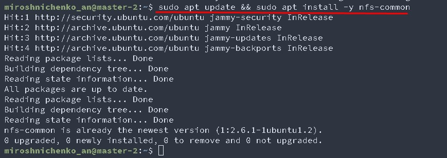

# Домашнее задание к занятию «Хранение в K8s. Часть 2»

### Цель задания

В тестовой среде Kubernetes нужно создать PV и продемострировать запись и хранение файлов.

------

### Чеклист готовности к домашнему заданию

1. Установленное K8s-решение (например, MicroK8S).
2. Установленный локальный kubectl.
3. Редактор YAML-файлов с подключенным GitHub-репозиторием.

------

### Дополнительные материалы для выполнения задания

1. [Инструкция по установке NFS в MicroK8S](https://microk8s.io/docs/nfs). 
2. [Описание Persistent Volumes](https://kubernetes.io/docs/concepts/storage/persistent-volumes/). 
3. [Описание динамического провижининга](https://kubernetes.io/docs/concepts/storage/dynamic-provisioning/). 
4. [Описание Multitool](https://github.com/wbitt/Network-MultiTool).

------

### Задание 1

**Что нужно сделать**

Создать Deployment приложения, использующего локальный PV, созданный вручную.

1. Создать Deployment приложения, состоящего из контейнеров busybox и multitool.
```
apiVersion: apps/v1
kind: Deployment
metadata:
  name: busybox-multitool
  namespace: default
  labels:
    app: busybox-multitool
spec:
  replicas: 1
  selector:
    matchLabels:
      app: busybox-multitool
  template:
    metadata:
      labels:
        app: busybox-multitool
    spec:
      containers:
      - name: busybox
        image: busybox
        imagePullPolicy: IfNotPresent
        command: ['sh', '-c', 'while true; do sleep 5;  echo $(date) Success! > /output/success.txt; done;']
        volumeMounts:
        - name: vol
          mountPath: /output
      - name: multitool
        image: praqma/network-multitool:latest
        imagePullPolicy: IfNotPresent
        command: ['sh', '-c', 'while true; do  sleep 5;  cat /input/success.txt; done;']
        volumeMounts:
        - name: vol
          mountPath: /input        
      volumes:
      - name: vol    
        persistentVolumeClaim:
          claimName: pvc-vol
```
   

2. Создать PV и PVC для подключения папки на локальной ноде, которая будет использована в поде.
```
apiVersion: v1
kind: PersistentVolume
metadata:
  name: pv1
spec:  
  capacity:
    storage: 1Gi
  accessModes:
  - ReadWriteOnce
  persistentVolumeReclaimPolicy: Retain
  storageClassName: ""
  hostPath:
    path: "/data/pv1"
---
apiVersion: v1
kind: PersistentVolumeClaim
metadata:
  name: pvc-vol
  namespace: default
spec:  
  accessModes:
  - ReadWriteOnce
  storageClassName: ""
  resources:
    requests:
      storage: 1Gi
```
   
3. Продемонстрировать, что multitool может читать файл, в который busybox пишет каждые пять секунд в общей директории. 
    
4. Удалить Deployment и PVC. Продемонстрировать, что после этого произошло с PV. Пояснить, почему.
#### PV перешел в статус Released, потому-что потелял связь с PVC 
   
5. Продемонстрировать, что файл сохранился на локальном диске ноды. Удалить PV.  Продемонстрировать что произошло с файлом после удаления PV. Пояснить, почему. 
#### После удаления PV файл не удалился потому, что persistentVolumeReclaimPolicy: Retain - определяет, что  после удаления PV ресурсы из внешних провайдеров автоматически не удаляются. 
   
   
5. Предоставить манифесты, а также скриншоты или вывод необходимых команд.

------

### Задание 2

**Что нужно сделать**

Создать Deployment приложения, которое может хранить файлы на NFS с динамическим созданием PV.

1. Включить и настроить NFS-сервер на MicroK8S.
    
    
    
2. Создать Deployment приложения состоящего из  из multitool, и подключить к нему PV, созданный автоматически на сервере NFS.
```
apiVersion: apps/v1
kind: Deployment
metadata:
  name: multitool
  namespace: default
  labels:
    app: multitool
spec:
  replicas: 1
  selector:
    matchLabels:
      app: multitool
  template:
    metadata:
      labels:
        app: multitool
    spec:
      containers:      
      - name: multitool
        image: praqma/network-multitool:latest
        imagePullPolicy: IfNotPresent
        command: ['sh', '-c', 'while true; do sleep 30;  echo $(date) Success! >> /data/success.txt; done;']
        volumeMounts:
        - name: vol
          mountPath: /data        
      volumes:
      - name: vol    
        persistentVolumeClaim:
          claimName: pvc-nfs
  ---
kind: PersistentVolumeClaim
apiVersion: v1
metadata:
  name: pvc-nfs
  labels:
    vol: pvc-nfs
  namespace: default
spec:
  storageClassName: "nfs"
  accessModes:
    - ReadWriteMany
  resources:
    requests:
      storage: 1Gi
```        
   
3. Продемонстрировать возможность чтения и записи файла изнутри пода. 
   
4. Предоставить манифесты, а также скриншоты или вывод необходимых команд.

------

### Правила приёма работы

1. Домашняя работа оформляется в своём Git-репозитории в файле README.md. Выполненное задание пришлите ссылкой на .md-файл в вашем репозитории.
2. Файл README.md должен содержать скриншоты вывода необходимых команд `kubectl`, а также скриншоты результатов.
3. Репозиторий должен содержать тексты манифестов или ссылки на них в файле README.md.
