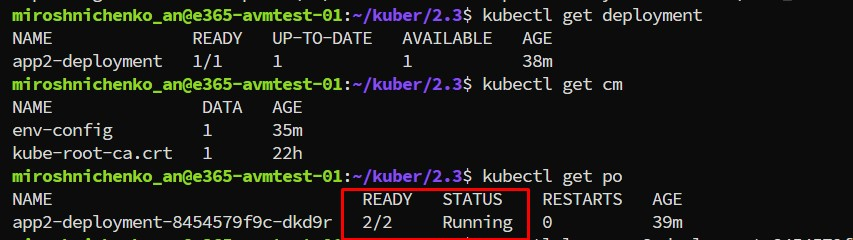
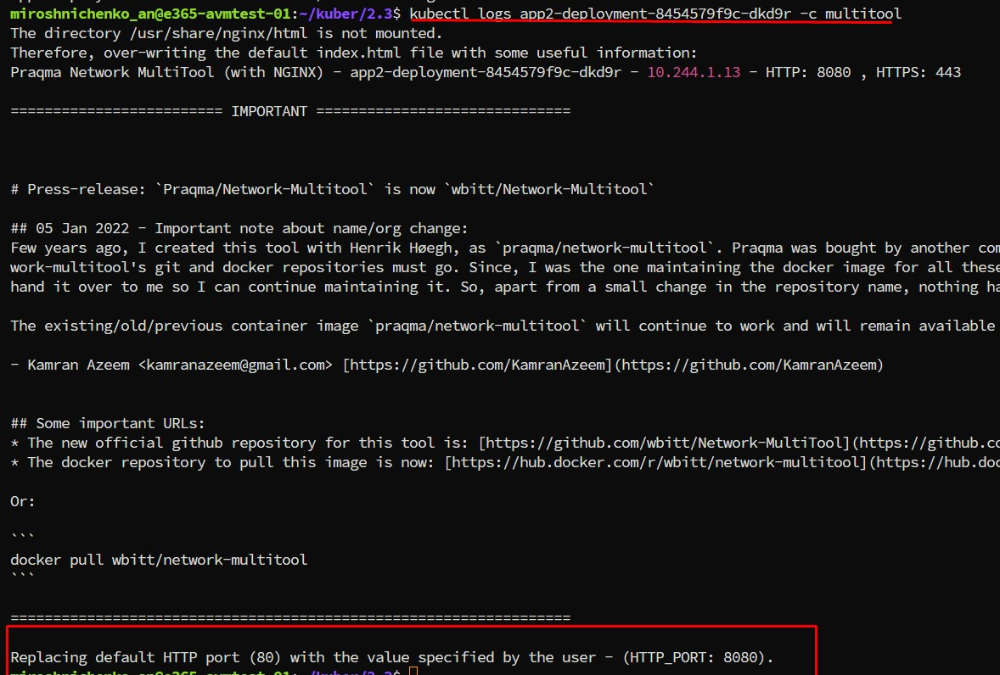
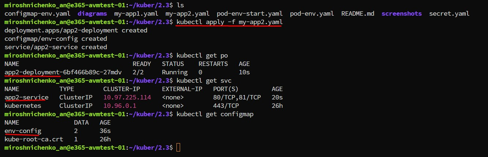
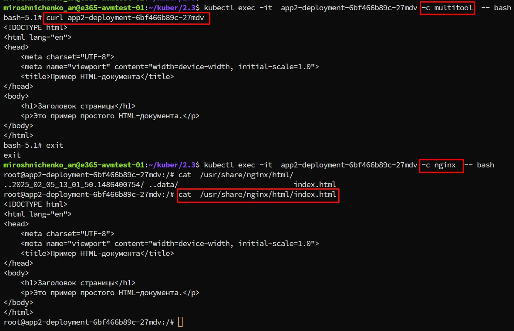
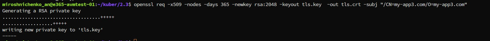
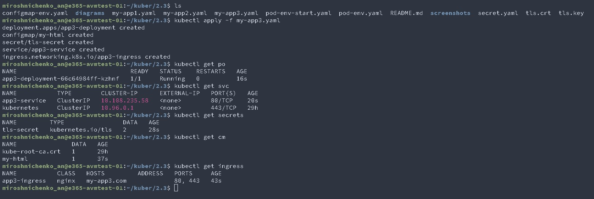
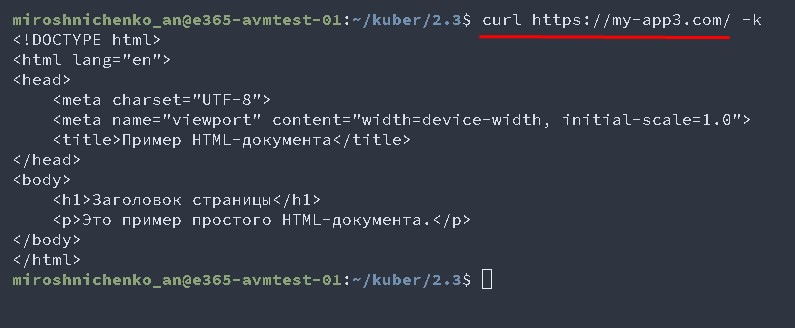
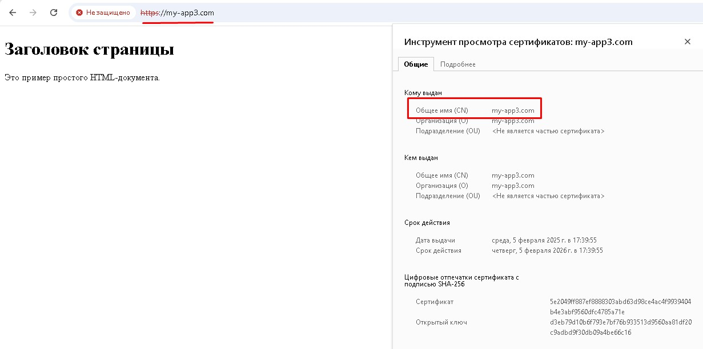

# Домашнее задание к занятию «Конфигурация приложений»

### Цель задания

В тестовой среде Kubernetes необходимо создать конфигурацию и продемонстрировать работу приложения.

------

### Чеклист готовности к домашнему заданию

1. Установленное K8s-решение (например, MicroK8s).
2. Установленный локальный kubectl.
3. Редактор YAML-файлов с подключённым GitHub-репозиторием.

------

### Инструменты и дополнительные материалы, которые пригодятся для выполнения задания

1. [Описание](https://kubernetes.io/docs/concepts/configuration/secret/) Secret.
2. [Описание](https://kubernetes.io/docs/concepts/configuration/configmap/) ConfigMap.
3. [Описание](https://github.com/wbitt/Network-MultiTool) Multitool.

------
```
echo 'Привет' |  base64
echo '0J/RgNC40LLQtdGCCg==' |  base64  --decode  # decode data  -d, --decode   
kubectl  get secrets env-secret -o yaml
openssl req -x509 -nodes -days 365 -newkey rsa:2048 -keyout tls.key  -out tls.crt -subj "/CN=my-app3.com/O=my-app3.com"
kubectl create secret tls  tls-secret --cert=tls.crt  --key=tls.key
```
### Задание 1. Создать Deployment приложения и решить возникшую проблему с помощью ConfigMap. Добавить веб-страницу

1. Создать Deployment приложения, состоящего из контейнеров nginx и multitool.
#####  Файл my-app2.yaml
```
apiVersion: apps/v1
kind: Deployment
metadata:
  name: "app2-deployment"
  labels:
    app: nginx-multitool
spec:
  replicas: 1
  selector:
    matchLabels:
      app: nginx-multitool
  template:
    metadata:
      labels:
        app: nginx-multitool
    spec:
      containers:
      - name: nginx
        image: nginx:latest
        imagePullPolicy: IfNotPresent
      - name: multitool
        image: praqma/network-multitool:latest
        imagePullPolicy: IfNotPresent
        env:
        - name: HTTP_PORT
          valueFrom:
            configMapKeyRef:
              name: env-config
              key: port        
```
2. Решить возникшую проблему с помощью ConfigMap.
#####  Файл my-app2.yaml
```
apiVersion: v1
kind: ConfigMap              
metadata:
  name: env-config
data:
  port: "8080"
```
3. Продемонстрировать, что pod стартовал и оба конейнера работают.
    
    
4. Сделать простую веб-страницу и подключить её к Nginx с помощью ConfigMap. Подключить Service и показать вывод curl или в браузере.
#####  Файл my-app2.yaml
```
apiVersion: v1
kind: ConfigMap              
metadata:
  name: env-config
data:
  port: "8080"
  index.html: |
    <!DOCTYPE html>
    <html lang="en">
    <head>
        <meta charset="UTF-8">
        <meta name="viewport" content="width=device-width, initial-scale=1.0">
        <title>Пример HTML-документа</title>
    </head>
    <body>
        <h1>Заголовок страницы</h1>
        <p>Это пример простого HTML-документа.</p>
    </body>
    </html>       
---
apiVersion: v1
kind: Service
metadata:
  name: "app2-service"
spec:
  selector:
    app: nginx-multitool 
  ports:   
    - name: nginx  
      protocol: TCP
      port: 80
      targetPort: 80
      protocol: TCP
    - name: multitool   
      port: 81
      targetPort: 8080 
  type: ClusterIP
```
5. Предоставить манифесты, а также скриншоты или вывод необходимых команд.
 
 

------

### Задание 2. Создать приложение с вашей веб-страницей, доступной по HTTPS 

1. Создать Deployment приложения, состоящего из Nginx.
#####  Файл my-app3.yaml
2. Создать собственную веб-страницу и подключить её как ConfigMap к приложению.
#####  Файл my-app3.yaml
3. Выпустить самоподписной сертификат SSL. Создать Secret для использования сертификата.
 
4. Создать Ingress и необходимый Service, подключить к нему SSL в вид. Продемонстировать доступ к приложению по HTTPS. 
#####  Файл my-app3.yaml
```
apiVersion: networking.k8s.io/v1
kind: Ingress
metadata:
  name: app3-ingress
spec:
  ingressClassName: nginx
  rules:
  - host: my-app3.com
    http:
      paths:
      - path: /
        pathType: Prefix
        backend:
          service:
            name: app3-service
            port:
              number: 80
  tls:
    - hosts:
      - my-app3.com
      secretName: tls-secret
```
  
4. Предоставить манифесты, а также скриншоты или вывод необходимых команд.
  
  
------

### Правила приёма работы

1. Домашняя работа оформляется в своём GitHub-репозитории в файле README.md. Выполненное домашнее задание пришлите ссылкой на .md-файл в вашем репозитории.
2. Файл README.md должен содержать скриншоты вывода необходимых команд `kubectl`, а также скриншоты результатов.
3. Репозиторий должен содержать тексты манифестов или ссылки на них в файле README.md.

------
