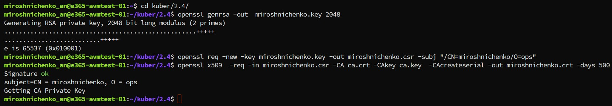
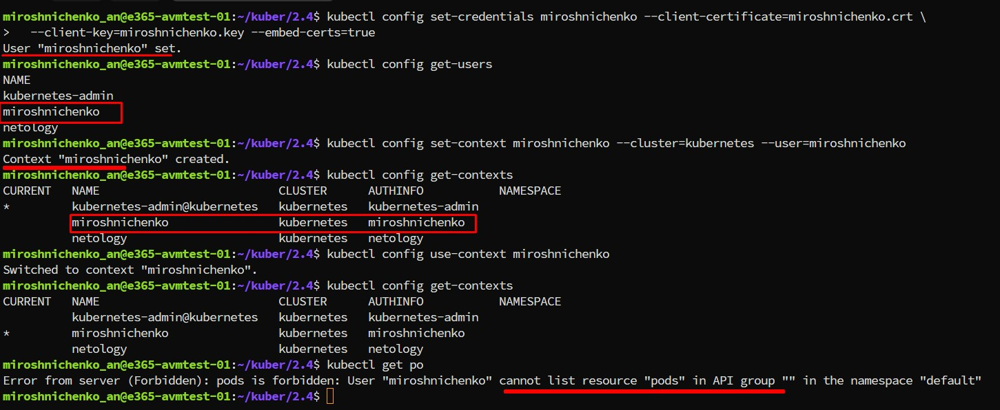
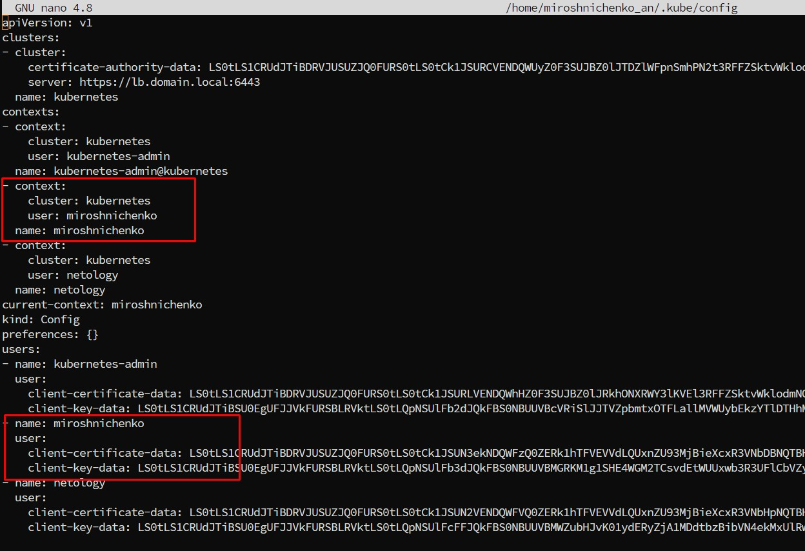
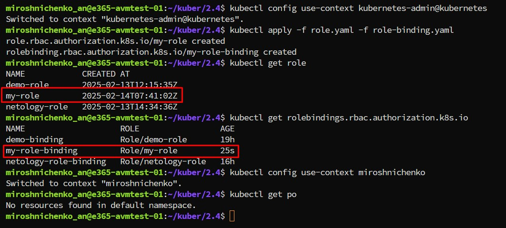
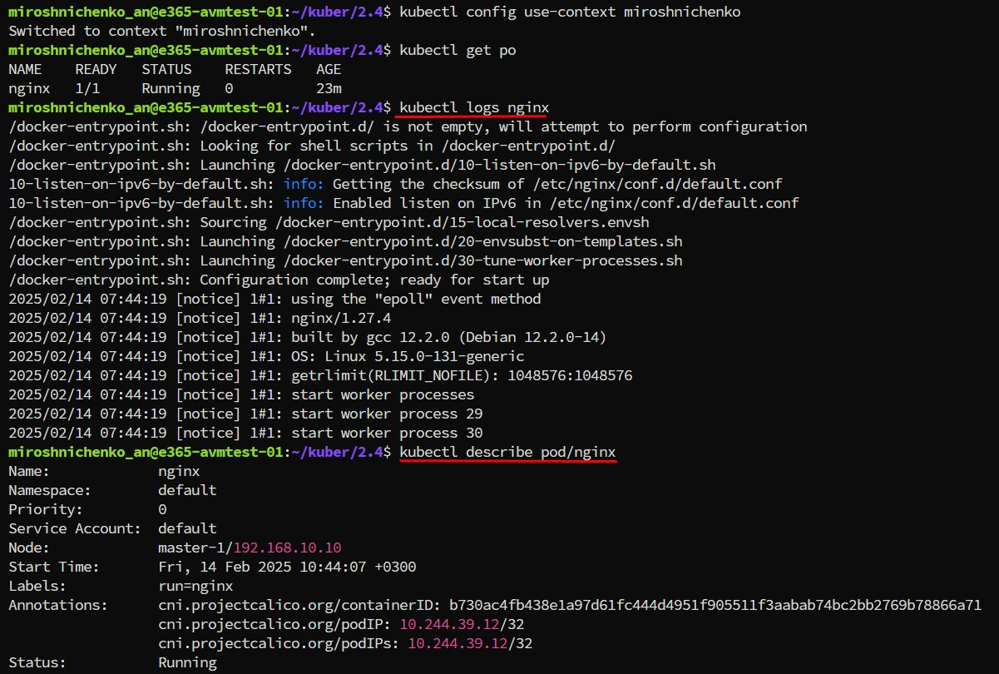

# Домашнее задание к занятию «Управление доступом»

### Цель задания

В тестовой среде Kubernetes нужно предоставить ограниченный доступ пользователю.

------

### Чеклист готовности к домашнему заданию

1. Установлено k8s-решение, например MicroK8S.
2. Установленный локальный kubectl.
3. Редактор YAML-файлов с подключённым github-репозиторием.

------

### Инструменты / дополнительные материалы, которые пригодятся для выполнения задания

1. [Описание](https://kubernetes.io/docs/reference/access-authn-authz/rbac/) RBAC.
2. [Пользователи и авторизация RBAC в Kubernetes](https://habr.com/ru/company/flant/blog/470503/).
3. [RBAC with Kubernetes in Minikube](https://medium.com/@HoussemDellai/rbac-with-kubernetes-in-minikube-4deed658ea7b).

------
```
kubectl create serviceaccount test
kubectl get  serviceaccount  
kubectl get sa
 kubectl describe sa test
 kubectl apply -f sa-token.yaml
 export TOKEN=eyJhbGciOiJSUzI1NiIsImt*****
 kubectl apply -f role.yam
 kubectl get role
 kubectl get rolebindings
 kubectl auth can-i get pods --as system:serviceaccount:default:test
 curl https://lb.domain.local:6443/api/v1/namespaces/default/pods  --header "Authorization: Bearer $TOKEN" --insecure
 kubectl apply -f claster_role.yaml
 openssl genrsa -out  miroshnichenko.key 2048
 openssl req -new -key miroshnichenko.key -out miroshnichenko.csr -subj "/CN=miroshnichenko/O=ops"
 scp miroshnichenko_an@158.160.61.192:/etc/kubernetes/pki/ca.key .
 scp miroshnichenko_an@158.160.61.192:/etc/kubernetes/pki/ca.crt .
 openssl x509  -req -in miroshnichenko.csr -CA ca.crt -CAkey ca.key  -CAcreateserial -out miroshnichenko.crt -days 500
 kubectl config set-credentials miroshnichenko --client-certificate=miroshnichenko.crt \
  --client-key=miroshnichenko.key --embed-certs=true
 kubectl config get-users 
 kubectl config set-context miroshnichenko --cluster=kubernetes --user=miroshnichenko
 kubectl config get-contexts 
 kubectl config use-context miroshnichenko
```

### Задание 1. Создайте конфигурацию для подключения пользователя

1. Создайте и подпишите SSL-сертификат для подключения к кластеру.  
[miroshnichenko.key](miroshnichenko.key), [miroshnichenko.crt](miroshnichenko.crt)
  
2. Настройте конфигурационный файл kubectl для подключения.
 
 
3. Создайте роли и все необходимые настройки для пользователя.  
[role](role.yaml), [role-binding](role-binding.yaml) 
 
4. Предусмотрите права пользователя. Пользователь может просматривать логи подов и их конфигурацию (`kubectl logs pod <pod_id>`, `kubectl describe pod <pod_id>`).
 
5. Предоставьте манифесты и скриншоты и/или вывод необходимых команд.

------

### Правила приёма работы

1. Домашняя работа оформляется в своём Git-репозитории в файле README.md. Выполненное домашнее задание пришлите ссылкой на .md-файл в вашем репозитории.
2. Файл README.md должен содержать скриншоты вывода необходимых команд `kubectl`, скриншоты результатов.
3. Репозиторий должен содержать тексты манифестов или ссылки на них в файле README.md.

------

